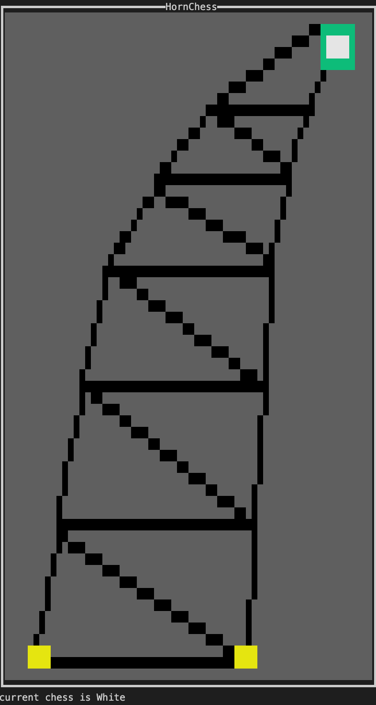
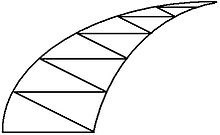
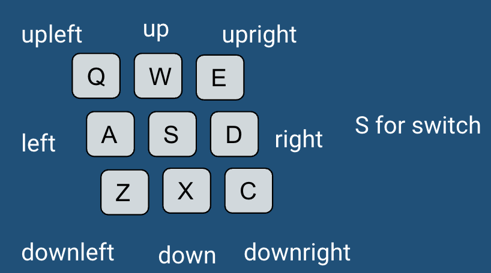

# HornChess


## Background
Horn Chess(牛角棋) is a traditional chess game for 2 gamers spread in China. In our final project of CSE 232 Fall 2021, we would love to implement the game and introduce it to you.

You can play it with the [link](https://glukkazan.github.io/breakthrough/horn-chess.htm).

## Chess Set
The checkerboard is a a curved triangle, with several straight lines drawn inside parallel to the bottom side and then diagonal lines are drawn to connect between the adjacent paralleled lines.



A has one chess piece; B has two pieces

## Rules
- At first, A puts one at the apex and B puts two at the bottom line
- Both one takes turns to move one of their piece, and A goes first
- The pieces must be moved along the line to the neighboring empty points. B's piece cannot be moved back
- A wins by reaching the bottom edge; B wins by preventing A from moving at the apex

## How to play?


## Design
We use Haskell and the brick library to implement the game.

## Team Members
[Chao Wang](https://github.com/Gandalfthegreat), [Mingxuan Zhang](https://github.com/johncheunghust), [Qiwen Zhao](https://github.com/ReynoldZhao), [Han Cao](https://github.com/caoh18)

# Milestone2

## Architecture of Horn Chess

* First of all, to display the graphical user interface of the game, we will use the required brick library to complete the UI.  
* Second, we will implement a data structure to represent the checkerboard of the Horn Chess. 

* Third, we need to record the status of every point of the checkerboard.
* Then, a game logic module will be designed. The module will decide at each of the point, how can the chess move. The module will also decide on what kind of circumstances will the player win according to the Horn Chess Rules.
* Finally, a instruction part should be displayed under the checkerboard to guide the players and display win or loss status.

## Challenge

* How to use brick library to display the specific pattern of the checkerboard of Horn Chess?

  The team is going to dive deep in the Haskell language and read the source code of example games which used the brick library. Then, we will learn how to implement the horn pattern checkerboard with the library.

* How to design the data structure to represent the checker board?

  After the group discussion, we explore more on the game. There are certain points in the checkerboard, and the coordinates of the points is hard to describe. Therefore, we find the number of points is limited, and we can simplify the coordinates of points by annotating them with integer and serial number. At the end, we are going to the Adjacency matrix to contain each of the point in the checkerboard, and the points they have access to.

* How to implement to game logic module of Horn Chess?

  Since we've decided to use Adjacency matrix to represent the checkerboard. Thus we have the information of every point and how can they move. Depends on that we have black chess and white chess, and the movement rules are different. We decided to use two other Adjacency matrix and a global points status to finish the logic. The two rule Adjacency matrix guides how can each chess move at every point of the checkerboard. And before they move, it should check whether the position is available by retrieve on the global points status. Then, according to the winning rule of Horn Chess, after every movement, we will check the status and positions of black and white chess to decide whether the game ends and who is the winner.

## Expectation

Yes, for now, we are positive that we can meet our goals before deadline


## For Developers


### Run
Production:
```
  stack run hornchess
```
Develop(hot update)
```
  stack build --file-watch
```