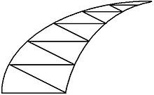

# HornChess

## Background
Horn Chess(牛角棋) is a traditional chess game for 2 gamers spread in China. In our final project of CSE 232 Fall 2021, we would love to implement the game and introduce it to you.

You can play it with the [link](https://glukkazan.github.io/breakthrough/horn-chess.htm).

## Chess Set
The checkerboard is a a curved triangle, with several straight lines drawn inside parallel to the bottom side and then diagonal lines are drawn to connect between the adjacent paralleled lines.

A has one chess piece; B has two pieces

## Rules
- At first, A puts one at the apex and B puts two at the bottom line
- Both one takes turns to move one of their piece, and A goes first
- The pieces must be moved along the line to the neighboring empty points. B's piece cannot be moved back
- A wins by reaching the bottom edge; B wins by preventing A from moving at the apex

## Design
We use Haskell and the brick library to implement the game.

## Team Members
Chao Wang, Mingxuan Zhang, Qiwen Zhao, Han Cao